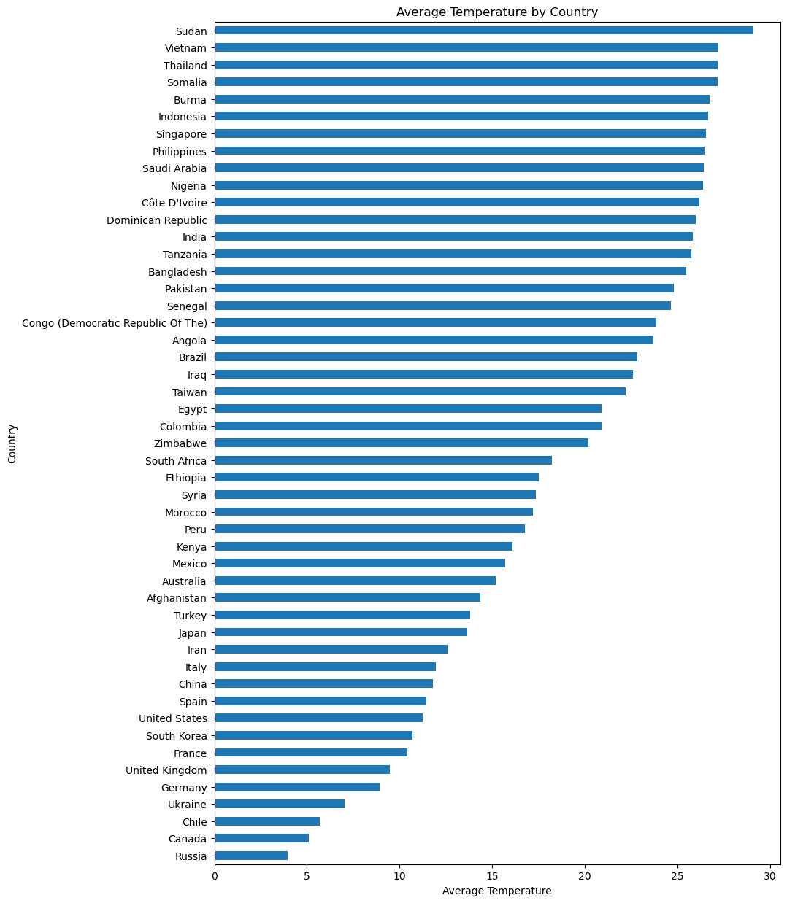

```python
import pandas as pd
import numpy as np
import matplotlib.pyplot as plt
import seaborn as sns
%matplotlib inline

data = pd.read_csv("/Users/hiywotz/Downloads/data-society-global-climate-change-data/GlobalLandTemperatures/GlobalLandTemperaturesByMajorCity.csv")
```


```python
import pandas as pd
import numpy as np
import matplotlib.pyplot as plt
import seaborn as sns
%matplotlib inline

data = pd.read_csv("/Users/hiywotz/Downloads/data-society-global-climate-change-data/GlobalLandTemperatures/GlobalLandTemperaturesByMajorCity.csv")
```
data.info()

```python
data.head()
date.today()
```


    datetime.date(2024, 4, 7)


```python
data.describe()
```


<div>
<style scoped>
    .dataframe tbody tr th:only-of-type {
        vertical-align: middle;
    }

    .dataframe tbody tr th {
        vertical-align: top;
    }

    .dataframe thead th {
        text-align: right;
    }
</style>
<table border="1" class="dataframe">
  <thead>
    <tr style="text-align: right;">
      <th></th>
      <th>AverageTemperature</th>
      <th>AverageTemperatureUncertainty</th>
    </tr>
  </thead>
  <tbody>
    <tr>
      <th>count</th>
      <td>228175.000000</td>
      <td>228175.000000</td>
    </tr>
    <tr>
      <th>mean</th>
      <td>18.125969</td>
      <td>0.969343</td>
    </tr>
    <tr>
      <th>std</th>
      <td>10.024800</td>
      <td>0.979644</td>
    </tr>
    <tr>
      <th>min</th>
      <td>-26.772000</td>
      <td>0.040000</td>
    </tr>
    <tr>
      <th>25%</th>
      <td>12.710000</td>
      <td>0.340000</td>
    </tr>
    <tr>
      <th>50%</th>
      <td>20.428000</td>
      <td>0.592000</td>
    </tr>
    <tr>
      <th>75%</th>
      <td>25.918000</td>
      <td>1.320000</td>
    </tr>
    <tr>
      <th>max</th>
      <td>38.283000</td>
      <td>14.037000</td>
    </tr>
  </tbody>
</table>
</div>


```python
from datetime import date

today = date.today()
print("Today's date:", today)
```

    Today's date: 2024-04-07


```python
plt.figure(figsize=(8, 6))
sns.histplot(data['AverageTemperature'], bins=30, kde=True)
plt.title('Distribution of Average Temperatures')
plt.xlabel('Temperature')
plt.ylabel('Frequency')
plt.show()
date.today()
```


    

    


    datetime.date(2024, 4, 7)


```python
countries = data['Country'].unique()
temp_by_country = data.groupby('Country')['AverageTemperature'].mean().sort_values()
plt.figure(figsize=(10, 15))
temp_by_country.plot(kind='barh')
plt.title('Average Temperature by Country')
plt.xlabel('Average Temperature')
plt.ylabel('Country')
plt.show()
date.today()
```


    

    


    datetime.date(2024, 4, 7)


```python

```
